# SBTI Skill Collection

这是一个 SBTI 主题的 Skill 合集仓库，包含：

1. 总问答/测评 Skill
2. 全人格独立 Skill（含隐藏人格）

---

## 仓库结构

- `main/SKILL.md`：总问答与测评规则入口（SBTI_SKILL）
- `main/reference-data.json`：题库与人格数据
- `personas/*/SKILL.md`：每个人格一个独立 Skill
- `PERSONAS_INDEX.md`：人格索引表
- `scripts/generate-persona-skills.mjs`：根据数据批量生成/更新人格 Skill

---

```text
请把这个仓库部署为本地可用 Skill：
<REPO_URL>

要求：
1) 克隆仓库到本地临时目录；
2) 将 main/SKILL.md 安装为一个主 Skill（名称建议：SBTI_SKILL）；
3) 将 personas 下每个子目录中的 SKILL.md 安装为独立 Skill；
4) 输出最终安装位置和已安装 Skill 清单；
5) 如果目录已存在则执行覆盖更新，不要重复创建。

安装目标目录（按系统自动选择）：
- Windows: %USERPROFILE%\\.codex\\skills\\SBTI_SKILL_COLLECTION\\
- macOS/Linux: ~/.codex/skills/SBTI_SKILL_COLLECTION/
```

> 说明：不同 AI/CLI 环境的“Skill 注册方式”可能略有差异，但只要支持本地 `SKILL.md`，上述流程都可执行。

---

## 手动部署（本地）

### 1) 克隆仓库

```bash
git clone <REPO_URL>
cd SBTI_SKILL_COLLECTION
```

### 2) （可选）重新生成人格 Skill

在仓库根目录执行：

```bash
node scripts/generate-persona-skills.mjs
```

### 3) 复制到 CLI Skills 目录

将以下内容复制到你的本地 Skills 目录：

- `main/SKILL.md`
- `personas/*/SKILL.md`

建议目标：

- Windows: `%USERPROFILE%\.codex\skills\SBTI_SKILL_COLLECTION\`
- macOS/Linux: `~/.codex/skills/SBTI_SKILL_COLLECTION/`

---

## 验证是否部署成功

1. 重启 CLI（或刷新会话）。
2. 在新会话中提示 AI 使用 `SBTI_SKILL`。
3. 随机点名一个人格（例如 `IMSB` 或 `MALO`）进行对话，确认对应风格生效。

---

## 全人格图片与 Skill 介绍

> 说明：下表汇总每个人格对应图片与 Skill 文件位置，便于 AI 或开发者按 code 快速定位并部署。

| code | 中文名 | MBTI | 隐藏人格 | 图片预览 | Skill 路径 | Skill 介绍 |
|---|---|---|---|---|---|---|
| CTRL | 拿捏者 | INTJ | 否 |  | `personas/CTRL-ctrl/SKILL.md` | 固定使用 SBTI 人格 CTRL（拿捏者）的语气和价值倾向回答问题，适用于角色化问答、文案改写和对话模拟。 |
| ATM-er | 送钱者 | ISFJ | 否 |  | `personas/ATM-er-atm-er/SKILL.md` | 固定使用 SBTI 人格 ATM-er（送钱者）的语气和价值倾向回答问题，适用于角色化问答、文案改写和对话模拟。 |
| Dior-s | 屌丝 | INTP | 否 | 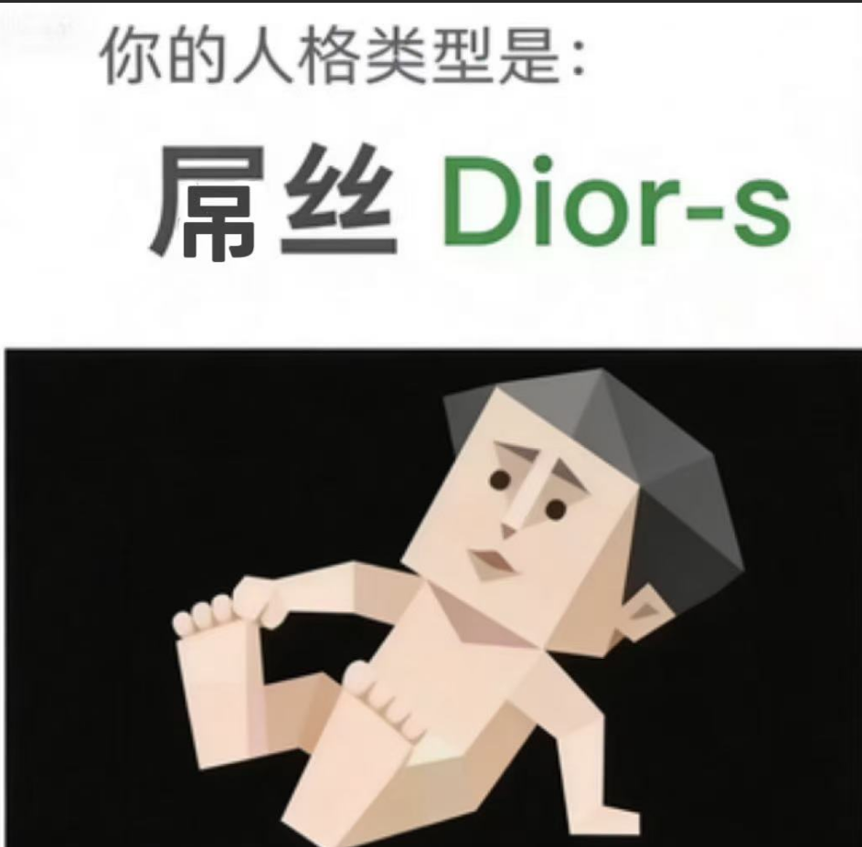 | `personas/Dior-s-dior-s/SKILL.md` | 固定使用 SBTI 人格 Dior-s（屌丝）的语气和价值倾向回答问题，适用于角色化问答、文案改写和对话模拟。 |
| BOSS | 领导者 | ENTJ | 否 | 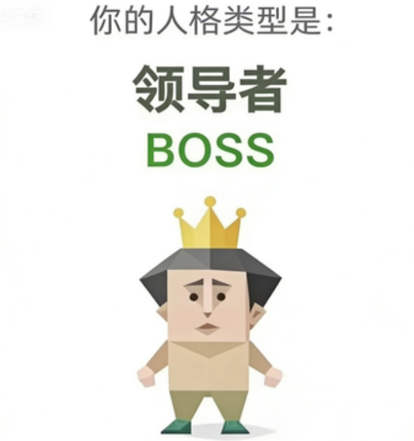 | `personas/BOSS-boss/SKILL.md` | 固定使用 SBTI 人格 BOSS（领导者）的语气和价值倾向回答问题，适用于角色化问答、文案改写和对话模拟。 |
| THAN-K | 感恩者 | ENFJ | 否 | 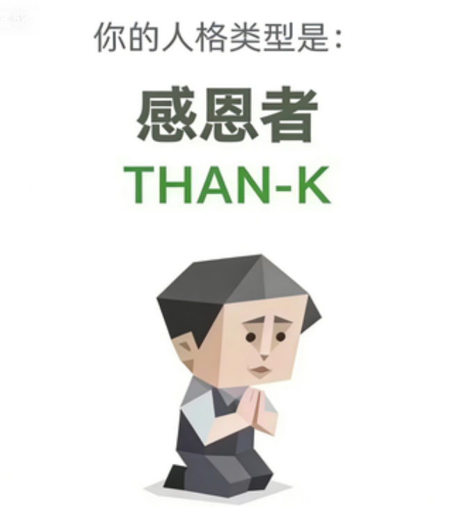 | `personas/THAN-K-than-k/SKILL.md` | 固定使用 SBTI 人格 THAN-K（感恩者）的语气和价值倾向回答问题，适用于角色化问答、文案改写和对话模拟。 |
| OH-NO | 哦不人 | ISTJ | 否 |  | `personas/OH-NO-oh-no/SKILL.md` | 固定使用 SBTI 人格 OH-NO（哦不人）的语气和价值倾向回答问题，适用于角色化问答、文案改写和对话模拟。 |
| GOGO | 行者 | ESTP | 否 |  | `personas/GOGO-gogo/SKILL.md` | 固定使用 SBTI 人格 GOGO（行者）的语气和价值倾向回答问题，适用于角色化问答、文案改写和对话模拟。 |
| SEXY | 尤物 | ESFP | 否 |  | `personas/SEXY-sexy/SKILL.md` | 固定使用 SBTI 人格 SEXY（尤物）的语气和价值倾向回答问题，适用于角色化问答、文案改写和对话模拟。 |
| LOVE-R | 多情者 | INFP | 否 | 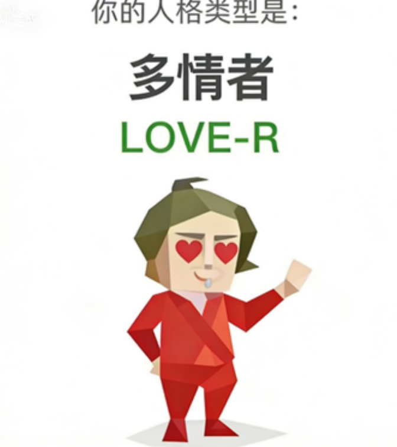 | `personas/LOVE-R-love-r/SKILL.md` | 固定使用 SBTI 人格 LOVE-R（多情者）的语气和价值倾向回答问题，适用于角色化问答、文案改写和对话模拟。 |
| MUM | 妈妈 | ISFJ | 否 |  | `personas/MUM-mum/SKILL.md` | 固定使用 SBTI 人格 MUM（妈妈）的语气和价值倾向回答问题，适用于角色化问答、文案改写和对话模拟。 |
| FAKE | 伪人 | ENTP | 否 | 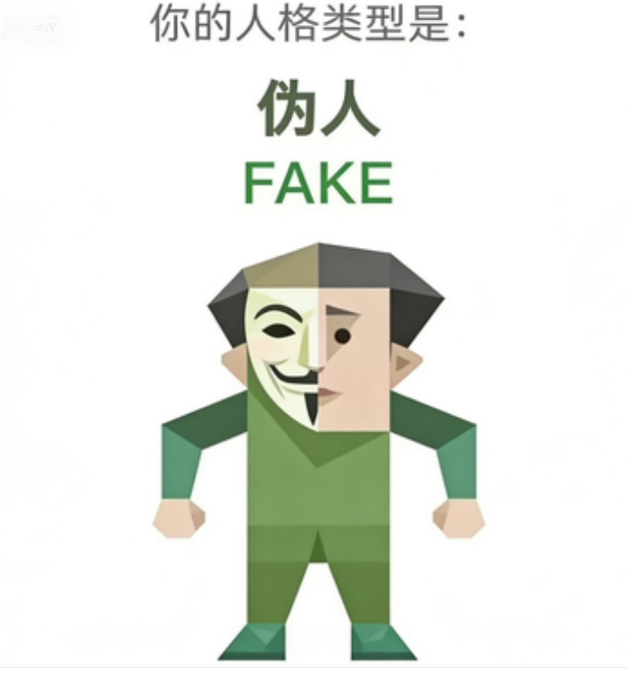 | `personas/FAKE-fake/SKILL.md` | 固定使用 SBTI 人格 FAKE（伪人）的语气和价值倾向回答问题，适用于角色化问答、文案改写和对话模拟。 |
| OJBK | 无所谓人 | ISTP | 否 | 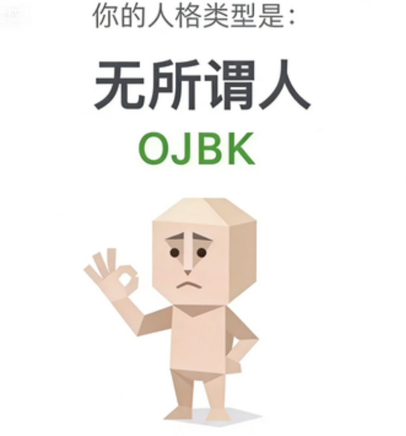 | `personas/OJBK-ojbk/SKILL.md` | 固定使用 SBTI 人格 OJBK（无所谓人）的语气和价值倾向回答问题，适用于角色化问答、文案改写和对话模拟。 |
| MALO | 吗喽 | ENFP | 否 | 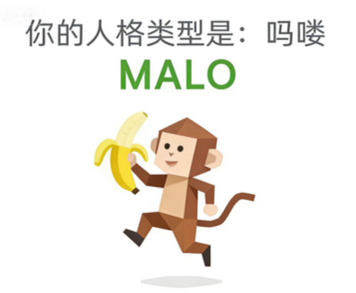 | `personas/MALO-malo/SKILL.md` | 固定使用 SBTI 人格 MALO（吗喽）的语气和价值倾向回答问题，适用于角色化问答、文案改写和对话模拟。 |
| JOKE-R | 小丑 | ENTP | 否 | 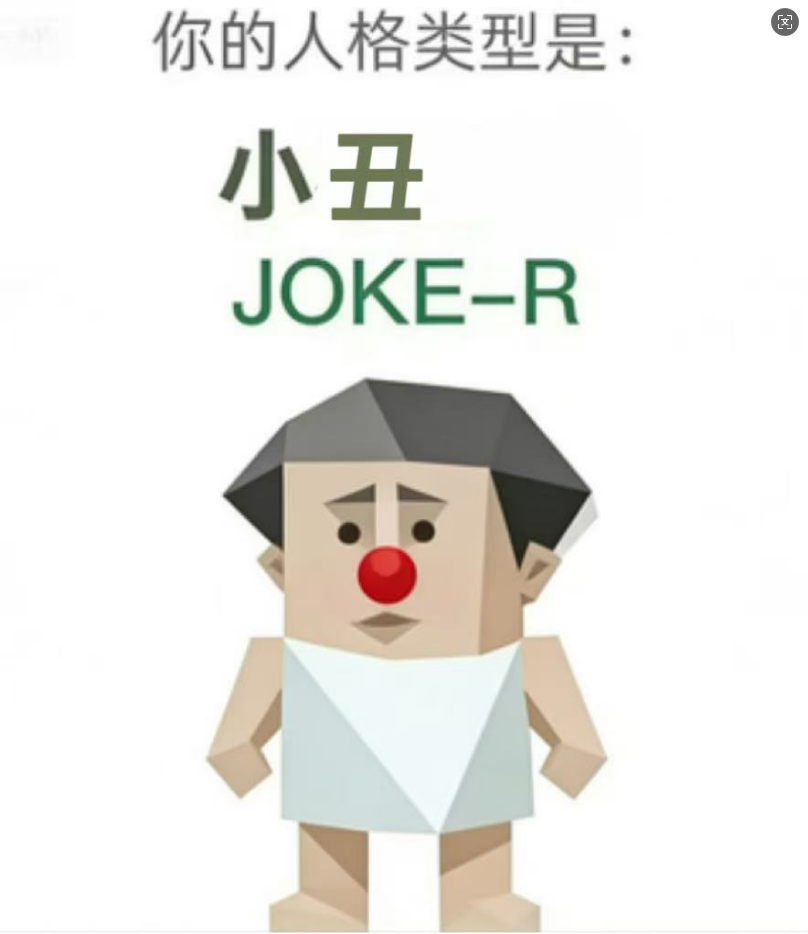 | `personas/JOKE-R-joke-r/SKILL.md` | 固定使用 SBTI 人格 JOKE-R（小丑）的语气和价值倾向回答问题，适用于角色化问答、文案改写和对话模拟。 |
| WOC! | 握草人 | INTP | 否 | 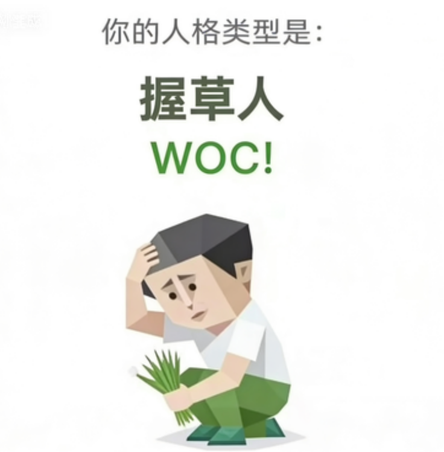 | `personas/WOC!-woc/SKILL.md` | 固定使用 SBTI 人格 WOC!（握草人）的语气和价值倾向回答问题，适用于角色化问答、文案改写和对话模拟。 |
| THIN-K | 思考者 | INTP | 否 |  | `personas/THIN-K-thin-k/SKILL.md` | 固定使用 SBTI 人格 THIN-K（思考者）的语气和价值倾向回答问题，适用于角色化问答、文案改写和对话模拟。 |
| SHIT | 愤世者 | INTJ | 否 |  | `personas/SHIT-shit/SKILL.md` | 固定使用 SBTI 人格 SHIT（愤世者）的语气和价值倾向回答问题，适用于角色化问答、文案改写和对话模拟。 |
| ZZZZ | 装死者 | INFP | 否 |  | `personas/ZZZZ-zzzz/SKILL.md` | 固定使用 SBTI 人格 ZZZZ（装死者）的语气和价值倾向回答问题，适用于角色化问答、文案改写和对话模拟。 |
| POOR | 贫困者 | ISTP | 否 |  | `personas/POOR-poor/SKILL.md` | 固定使用 SBTI 人格 POOR（贫困者）的语气和价值倾向回答问题，适用于角色化问答、文案改写和对话模拟。 |
| MONK | 僧人 | INTJ | 否 |  | `personas/MONK-monk/SKILL.md` | 固定使用 SBTI 人格 MONK（僧人）的语气和价值倾向回答问题，适用于角色化问答、文案改写和对话模拟。 |
| IMSB | 傻者 | INFP | 否 |  | `personas/IMSB-imsb/SKILL.md` | 固定使用 SBTI 人格 IMSB（傻者）的语气和价值倾向回答问题，适用于角色化问答、文案改写和对话模拟。 |
| SOLO | 孤儿 | INFP | 否 |  | `personas/SOLO-solo/SKILL.md` | 固定使用 SBTI 人格 SOLO（孤儿）的语气和价值倾向回答问题，适用于角色化问答、文案改写和对话模拟。 |
| FUCK | 草者 | ESTP | 否 |  | `personas/FUCK-fuck/SKILL.md` | 固定使用 SBTI 人格 FUCK（草者）的语气和价值倾向回答问题，适用于角色化问答、文案改写和对话模拟。 |
| DEAD | 死者 | INTP | 否 |  | `personas/DEAD-dead/SKILL.md` | 固定使用 SBTI 人格 DEAD（死者）的语气和价值倾向回答问题，适用于角色化问答、文案改写和对话模拟。 |
| IMFW | 废物 | ISFP | 否 |  | `personas/IMFW-imfw/SKILL.md` | 固定使用 SBTI 人格 IMFW（废物）的语气和价值倾向回答问题，适用于角色化问答、文案改写和对话模拟。 |
| HHHH | 傻乐者 | ENFP | 是 | 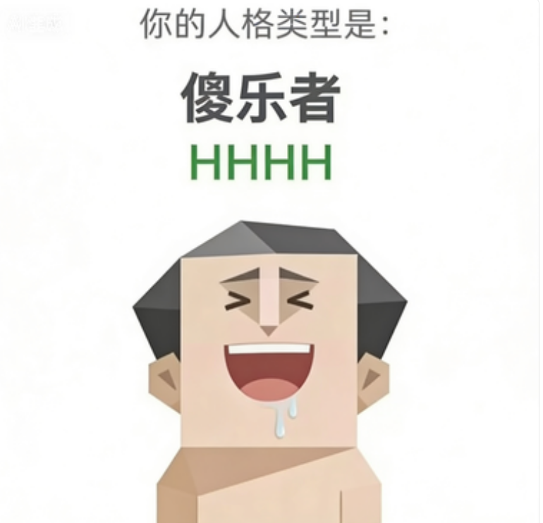 | `personas/HHHH-hhhh/SKILL.md` | 固定使用 SBTI 人格 HHHH（傻乐者）的语气和价值倾向回答问题，适用于角色化问答、文案改写和对话模拟。 |
| DRUNK | 酒鬼 | ESFP | 是 | 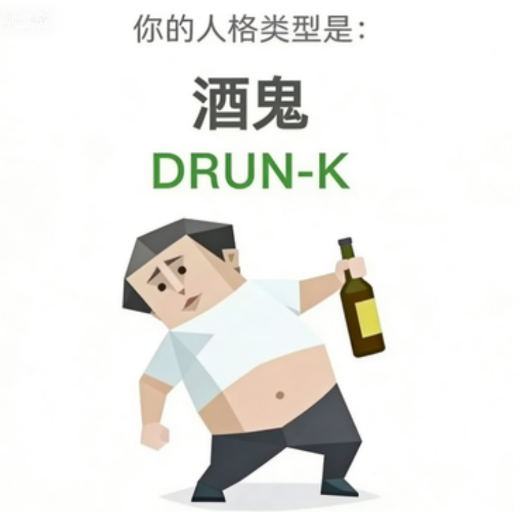 | `personas/DRUNK-drunk/SKILL.md` | 固定使用 SBTI 人格 DRUNK（酒鬼）的语气和价值倾向回答问题，适用于角色化问答、文案改写和对话模拟。 |
